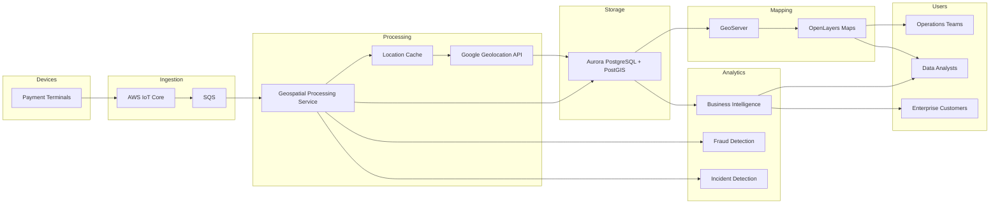
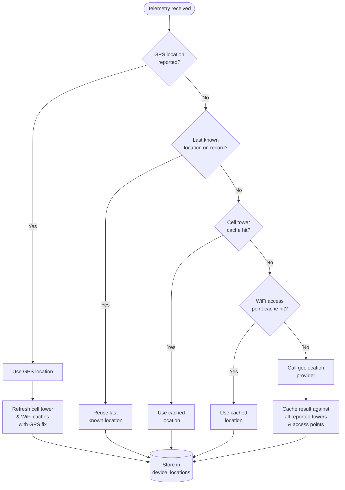

In this blog I want to demonstrate a geospatial system that I had planned to build for monitoring payment terminals used by merchants. While the original use case was focused on payments, I think the same concepts apply to a wide range of connected devices, including payment terminals, kiosks, sensors, and other IoT deployments.

I was disappointed that I never had the opportunity to finish this project before leaving my previous company. Rather than let the idea disappear, I decided to document it here and provide a proof-of-concept repository so others can experiment with the approach and determine whether it could be useful in their own environments.

## Potential Use Cases

### Automatic Detection of Cell Tower Outages

One of the first questions during an incident is whether the issue is being caused by one of the cellular providers.

The challenge is that payment terminals often do not generate explicit errors when connectivity is lost. They simply stop transacting.

There are many reasons why a terminal may not be processing transactions:

- The merchant may be closed.
- Business activity may be unusually slow due to weather or local events.
- There may be a software issue.
- There may be a network outage affecting a specific area.

Without location intelligence, determining the root cause can take significant time. My team's goal was to reduce **MTTI (Mean Time to Identify)** during incidents. By monitoring the geographic distribution of terminal activity, it becomes much easier to identify patterns that suggest a carrier or infrastructure outage.

### Enhanced Fraud Detection

A common fraud scenario involves the theft of a payment terminal followed by refund activity from a different location.

If terminal location is being monitored, a fraud engine can be notified when a device moves significantly from its expected location. If suspicious transactions occur shortly after that movement, the fraud detection system has an additional signal that can be used to identify potentially fraudulent behaviour.

Location alone is not enough to prove fraud, but it can be a valuable feature when combined with existing fraud models.

### Enhanced Business Analytics

A geospatial platform can also provide sophisticated business intelligence for enterprise customers.

Examples include:

- "Show me suburbs with the highest coffee shop sales where my business does not currently have a store."
- "Show me stores that are underperforming compared to the industry average in the surrounding area."
- "Show me sales trends by region over the last six months."
- "Identify growth corridors where transaction volume is increasing rapidly."

These types of insights become much easier when transaction and device data can be analysed spatially.

## The Main Challenge: Cost

The biggest challenge was obtaining location data at scale.

After evaluating several providers, we decided that Google's Geolocation API offered the best accuracy for our use case.

Although newer payment terminals often include GPS hardware, GPS is frequently unreliable indoors where most terminals operate. Many devices do not have a direct line of sight to satellites. Some devices use cellular connectivity, while others may only have Wi-Fi available.

Google's Geolocation API can combine information from:

- IP addresses
- Wi-Fi access points
- Cell tower data

to estimate the most accurate location possible.

### The Cost Problem
Google's pricing initially appeared reasonable. However, the numbers become much larger when scaled across an entire fleet.
For a large fleet of payment terminals receiving frequent location lookups around the clock, the result is hundreds of millions of API calls per month.
Using Google's published pricing at the time, this could cost tens of thousands of dollars per month.
That estimate is likely higher than reality because:

Not all terminals are powered on 24 hours a day.
Many merchants only operate during business hours.
Volume discounts would likely apply.
Location changes occur far less frequently than telemetry updates.

Even so, it is a significant cost for a single metric, regardless of how valuable that metric may be.

### Reducing Costs Through Caching

Under those conditions, monthly costs could potentially drop from tens of thousands of dollars to a few hundred dollars per month.
Before rolling this out across the production fleet, my plan was to enable telemetry collection while feature-toggling the Google API calls. This would allow us to gather real-world metrics for a month and validate the assumptions before incurring any significant cost.
Based on a rough Fermi estimation approach, I expected annual external API costs to remain in low four figures annually if the cache behaved as anticipated.

### Step 1: Cell Tower Dataset

I sourced a publicly available global cell tower dataset and filtered it down to Australian towers only.

The dataset was then cleaned so it contained only the fields required for geolocation matching.

### Step 2: Location Cache

The system would maintain a cache of previously resolved locations.

When new telemetry arrived, the processing service would follow this sequence:

1. Check whether the device already has a known latitude and longitude.
2. Query the geospatial cache to determine whether the current cell tower or network signature has already been resolved.
3. Reuse the cached location if available.
4. If no cached location exists, call Google's Geolocation API.
5. Store the result in both the cache table and the device location table.

The cache would be indexed using a Top-K style lookup structure to allow efficient matching of frequently observed tower combinations.

### Step 3: Minimise External Calls

Once the cache had been populated, the vast majority of location requests would never leave our environment.

In the ideal case:

- Devices remain stationary.
- Cell tower associations remain stable.
- Cached locations are continuously reused.

Under those conditions, monthly costs could potentially drop from tens of thousands of dollars to approximately **$700 per month**.

Before rolling this out across the production fleet, my plan was to enable telemetry collection while feature-toggling the Google API calls. This would allow us to gather real-world metrics for a month and validate the assumptions before incurring any significant cost.

Based on a rough Fermi estimate, I expected annual external API costs to remain below **$3,000 per year** if the cache behaved as anticipated.

There was also a mechanism planned to bypass the cache entirely when required. This would allow fraud analysts or support engineers to force a live geolocation lookup for diagnostics or investigations. Routine monitoring would continue to rely on cached tower locations.

## System Architecture

The proposed solution consisted of four primary components.

> **PostGIS** is an extension for PostgreSQL that adds support for geographic objects, spatial queries, and geospatial indexing — things like storing coordinates, calculating distances, and querying which devices fall within a polygon. **GeoServer** is an open-source server that publishes spatial data as standardised map services (WMS, WFS), allowing map tiles and feature layers to be consumed by client applications such as Leaflet or OpenLayers.




### AWS IoT

AWS IoT handled ingestion and routing of:

- Device telemetry
- Connectivity events
- Last Will and Testament (LWT) messages

This provided a scalable and reliable mechanism for collecting data from the fleet.

### GeoServer

A GeoServer instance running in EKS would provide:

- Map services
- Feature services
- Spatial layers
- Tile generation

GeoServer was configured to store its tile cache in S3 using a GeoServer plugin, allowing the cache to be shared across multiple instances.

### Aurora PostgreSQL with PostGIS

All geospatial data would be stored in Aurora PostgreSQL with the PostGIS extension enabled.

PostGIS provides a rich set of spatial capabilities including:

- Spatial indexing
- Distance calculations
- Polygon operations
- Geofencing
- Heat maps
- Spatial aggregations

This became the foundation for both operational monitoring and analytics.

### Telemetry Processing Service

The final component was a custom application running in EKS.

This service consumed telemetry from an SQS queue and acted as the central processing engine.

Its responsibilities included:

- Processing location telemetry
- Querying the location cache
- Calling external geolocation providers when required
- Updating device records
- Generating fraud signals
- Generating operational alerts
- Feeding incident detection workflows

This service was effectively the brain of the platform.

### Data Consumers

The processed geospatial information could then be consumed by a variety of internal systems.

Most visualisation would be provided through OpenLayers-based maps embedded within existing operational and business applications.

### Location Resolution Flow

The decision logic inside the processing service follows a strict cache-first hierarchy. Only the leftmost path that produces a result is used — every path below it is skipped.




GPS is always preferred when available because it is the most precise source, and the processing service uses it as an opportunity to warm the caches for the cell towers and access points reported in the same message. For everything else, the service works down the hierarchy until it finds a hit, only calling an external provider when the cache has no match at all.

## Current State

Before leaving my last company, I had already built several of the major components:

- GeoServer running in EKS
- S3-backed tile caching
- Aurora PostgreSQL with PostGIS
- Initial geospatial schemas and services

For the purposes of this blog and the accompanying proof-of-concept repository, I'll keep things much simpler.

Rather than recreating the full AWS deployment, I'll run GeoServer and PostGIS locally using Docker and focus on demonstrating the core concepts. The S3-backed tile cache and production infrastructure can be ignored for now so we can concentrate on the geospatial workflows themselves. I will have a geospatial api that will handle the processing of the telemetry and managing the external calls and cache.

The accompanying [proof-of-concept repository]({{ page.source_code }}) now has a working version of this: a small Spring Boot service backed by the PostGIS schema above, plus a seeded demo fleet so the whole flow can be explored end-to-end without any AWS dependencies.

## Try the Demo


### Location Resolution

The core of the service is a single `POST /telemetry` endpoint that mirrors the caching strategy described earlier.

If the device reports its own GPS/fused location, that's used directly - it's more precise than anything else available - and it's also used to refresh the cell tower and WiFi caches for the signals reported alongside it.

Otherwise, the service works through the following, in order, until it finds a location:

1. Use the device's last known location if one is already on record.
2. Check the cell tower cache for the reported cell tower(s).
3. Check the WiFi access point cache, starting with whichever access point the device is currently connected to.
4. Only if none of the above are cached, fall back to a geolocation provider and cache the result against every cell tower and access point reported.

The geolocation provider is pluggable. A `stub` provider returns a deterministic location derived from the cell tower ID, so the whole demo runs without any external dependencies, while a `google` provider calls the real Google Geolocation API if you supply an API key.


Originally I'd assumed the cache would need something like the Top-K lookup structure described earlier - matching against the *combination* of cell towers a device could see, ranked by how often that combination occurred. In practice it turned out to be much simpler: each cell tower and WiFi access point already has a stable identifier (`mcc`/`mnc`/`lac`/`cell_id` for towers, `bssid` for access points), so a plain exact-match lookup against each one individually is enough. A device's scan list changes from one telemetry message to the next as towers and access points come in and out of range, but any single previously-seen identifier in that list is enough for a cache hit - no combination matching or ranking required.

### Demo Fleet and Support Pages

The PostGIS database is seeded with 1,000 simulated payment terminals (`terminal-1001` through `terminal-2000`) scattered around Australia's major cities, each with telemetry (battery, network provider, active SIM, merchant category), a connectivity history, and 30 days of sales data.

A small set of server-rendered pages sit on top of the API for browsing and exercising this fleet:

- **Devices** - a table of every terminal with its current connectivity status, network provider, location, and last-seen time, linking to a detail page where telemetry can be viewed and edited directly.
- **Connectivity Simulator** - send `online`, `expected_offline`, or `unexpected_offline` events for a device, the same way a real terminal's MQTT "last will and testament" message would, and watch its connectivity history update.
- **Location Telemetry** - submit a sample cell tower / WiFi / GPS payload to `/telemetry` and see which resolution path (cache, GPS, or geolocation provider) was used and what location came back.


### Demo Maps

Three Leaflet maps render WMS layers served by GeoServer:

- **Terminals by Connectivity Status** - every terminal, colored green, orange, or red by online, expected-offline, or unexpected-offline status, with a toggle per status.
- **Terminals by SIM Provider & Cell Towers** - terminals colored by SIM provider (Telstra, Optus, Vodafone, other) alongside the cell tower network they're attached to, with optional coverage circles per carrier.
- **Terminal Sales by Day** - a day-by-day heatmap of sales per terminal, using a date picker to step through the 30 days of seeded sales history.


### Running It

Everything runs with a single command from the repo root:

```bash
docker compose up -d
```

This brings up PostGIS, GeoServer, and the processing service together. The home page at `http://localhost:8081` links to all of the support pages and demo maps above, and the [repo README]({{ page.source_code }}) has the full setup details, including the telemetry API reference for anyone who wants to script against it directly.

### Caveats

This is a proof-of-concept, not a production deployment. A few things worth knowing before running it:

**Google Geolocation API coverage.** The `google` provider has been tested against real cell tower data and produces accurate results. WiFi-based resolution has seen less real-world testing due to limited access point input data, so cell tower resolution is the more reliable of the two paths when using a live API key. The `stub` provider is the default and requires no credentials.

**Security.** The original production system had PostGIS and GeoServer fully secured. This demo deliberately leaves the default credentials in place to keep setup frictionless — it is intended to run locally and should not be exposed beyond localhost.

**Prior geospatial knowledge is not required.** This post does not attempt to explain how geospatial systems work in general. The demo is intentionally self-contained: the support pages and maps are there to make the concepts tangible without requiring any prior familiarity with PostGIS, GeoServer, or spatial data.
