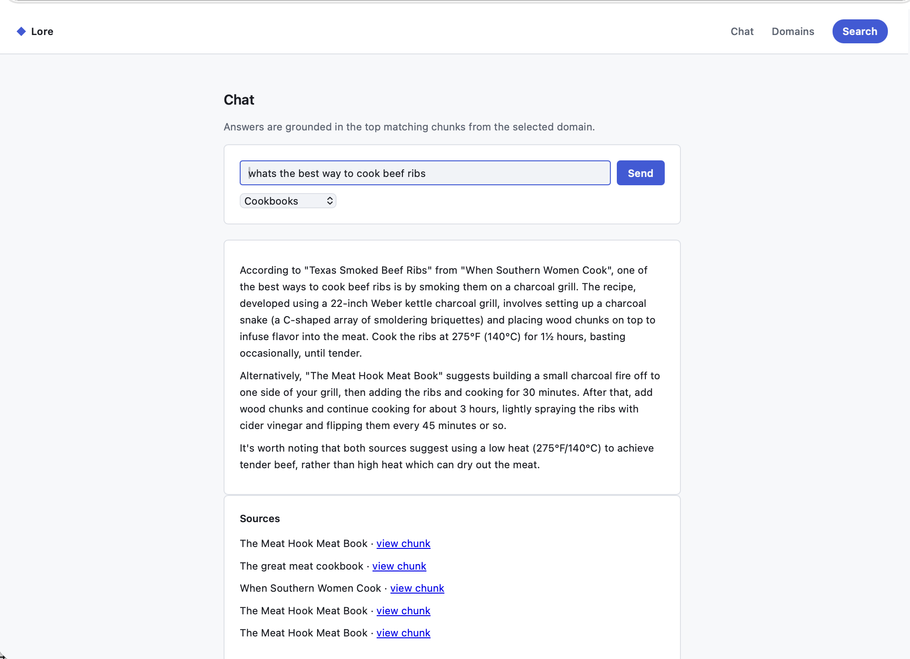
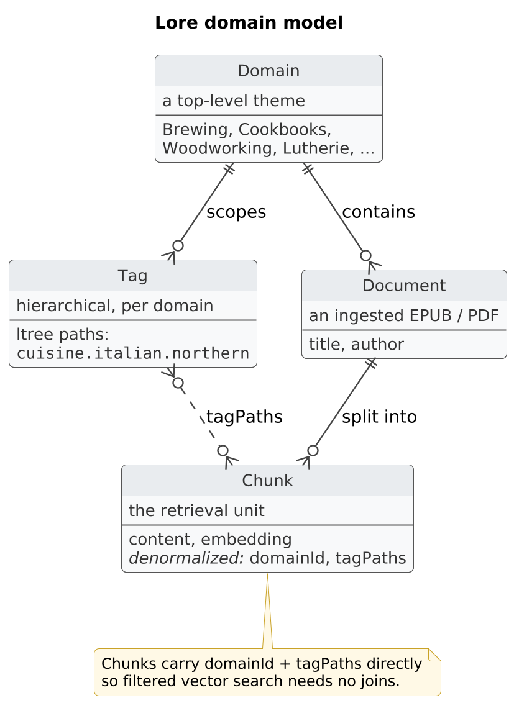
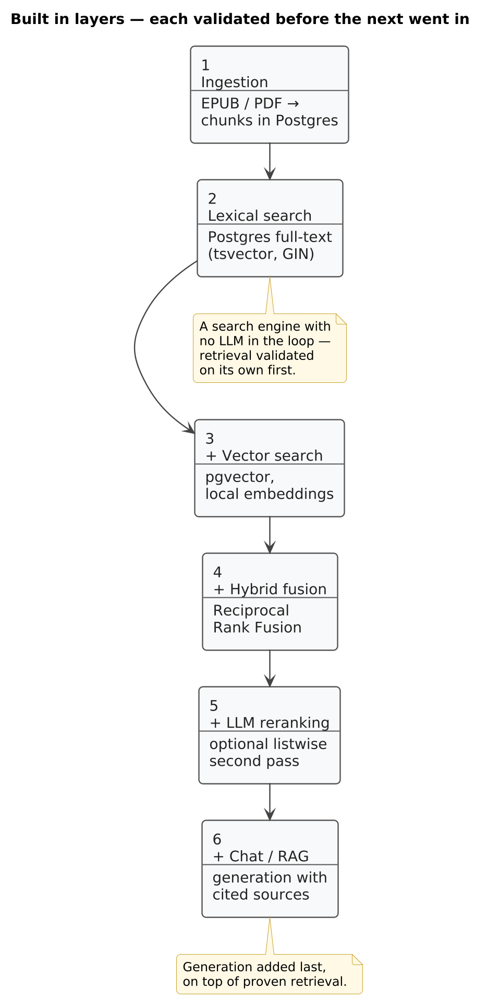
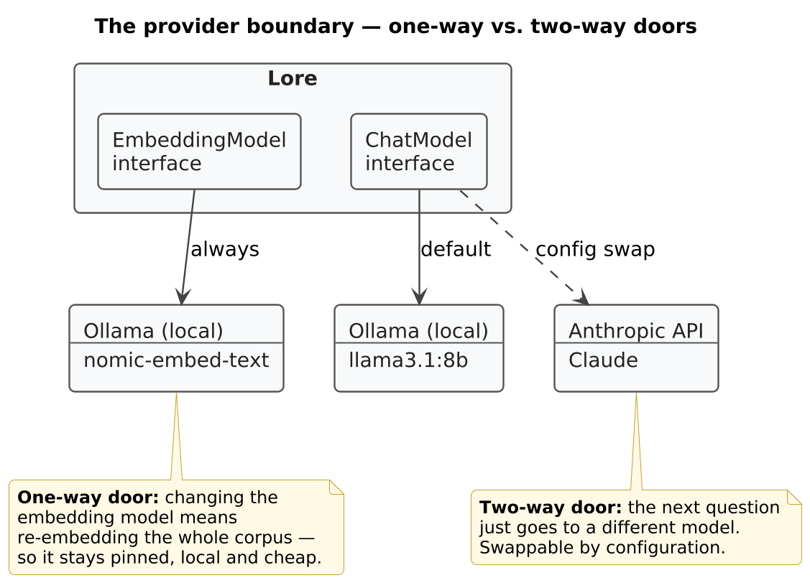

I own a few hundred cookbooks — over 600 at last count, which would be more if I hadn't started culling the shelf every few years to make room for new ones. Past cooking, there are shelves dedicated to woodworking, brewing, blacksmithing, and permaculture. I love pulling one down and reading it like a novel, but when I'm actually cooking, unless I'm after a specific recipe from a specific chef, I reach for a search engine instead — flipping through an index is slower than typing a question. That's part of why I started buying EPUBs and PDFs alongside the paper copies: sometimes they're cheaper, and they don't take up shelf space.

The trouble is I still can't search any of it well. The Books app only indexes title and author, not content, so a library's worth of PDFs and EPUBs scattered across drives and cloud storage is barely easier to query than the paper. When I want to know what temperature to hold a saison fermentation at, or what makes a good cinnamon roll, I *know* the answer is in one of these books — I just don't know which one, and flipping through five of them is slower than asking a search engine and getting a worse, less trusted answer from a random forum post.

So I built Lore: a local-first RAG system that ingests my EPUBs and PDFs, organizes them by topic, and answers questions in natural language — with citations back to the exact source chunks, so I can verify the answer against the real page instead of taking the model's word for it.

It's not a production system, and the interface reflects that — I put in just enough effort to keep it out of my own way.

## What Lore is

Answers come back Perplexity-style: the generated answer, plus the exact chunks that informed it, each with the source document, its location, and the retrieval scores. If an answer looks off, the evidence is right there to check.

There's a secondary motivation worth admitting up front. Almost every RAG reference implementation you'll find is Python — LangChain, LlamaIndex, and their ecosystems. If you work on the JVM, worked examples are thin. Lore is built with Spring Boot, Kotlin, and Spring AI, and part of the reason it's public is to be the reference implementation I couldn't find. It's a personal tool first and a reference implementation second, but if you're here for the Kotlin angle, this series has you in mind.

There's a personal-learning motivation too. Over the last couple of years I've wanted to get past prompting and agentic coding into how these systems are actually built, and a real project seemed like the way to do it. I'm mostly a Kotlin/Spring Boot developer, so Spring AI was the natural next step before I pivot to some home-automation ideas where Python or Node will probably fit better. Wanting Lore to run against my own documents without depending on a third-party provider is also what pushed it toward local-first — more on that trade-off below.

## The shape of the thing

There isn't much to the domain model, which is deliberate.

A **Domain** is a top-level theme: Brewing, Cookbooks, Woodworking, Lutherie, Permaculture. Each domain contains **Documents**, and each document is split into **Chunks** — the retrieval unit everything else operates on. Within a domain, hierarchical **Tags** organize and filter content, stored as Postgres `ltree` materialized paths, so `cuisine.italian.northern` is a real path you can query by prefix, not a flat label.

One design note that matters for later posts: each chunk carries its `domainId` and tag paths directly, denormalized, rather than resolving them through joins at query time. The reason is filtered vector search performance — the vector leg filters by domain and tags in the same index pass. It costs some normalization purity but keeps the hot query path simple and fast. That trade-off comes up again in the hybrid search post; for now it's just context.

## The build philosophy: search engine first, RAG second

The sequencing decision that shaped the whole project: get plain retrieval working and validated *before* adding an LLM generation step on top of it.

I took this approach for a few reasons. Most of the reading I'd done on RAG systems made a point of the garbage-in, garbage-out problem: if retrieval is bad, no amount of prompt engineering on the generation step fixes it — you're just asking a language model to write a fluent answer from the wrong source material. And the failure mode is nasty, because the answer still *reads* fine. A confident, well-written response built on the wrong chunks is worse than an error message, since nothing about it tells you to distrust it.

Building retrieval first also meant I got a search engine for free. Lore has a search endpoint with no LLM anywhere in the loop — query in, ranked chunks out, from both the keyword and semantic legs. That's useful in its own right, and it made retrieval quality something I could test and inspect directly. "Does the right chunk come back for this query?" is a question you can answer by looking, and when the answer was no, I could see whether the problem was chunking, indexing, or ranking — cheaply, where the problem actually lives.

Retrieval itself was built in layers, in deliberate order. Lexical search came first — classic Postgres full-text search, a well-understood retrieval method that's been around for decades. That confirmed the whole pipeline end-to-end: ingestion → storage → query → ranked results. Only once that foundation held did the embeddings go in, then hybrid fusion combining both legs, then an optional LLM reranking pass, and finally — last of all — chat generation on top.

The diagram is drawn as layers added over time rather than one architecture that appeared fully formed, because that's what actually happened, and because each layer was validated against the ones below it before going in.

## Local-first, with an escape hatch

The core commitment: Lore runs entirely on your own machine. Ollama serves both the chat model and the embedding model (defaults: `llama3.1:8b` for chat, `nomic-embed-text` for embeddings), Postgres runs in Docker Compose, and your library never leaves your hardware. For a personal knowledge base — the contents of your bookshelf, your notes, whatever you feed it — not shipping it to a third party by default is the right default. Privacy, cost, and offline use all point the same direction.

There's a pragmatic caveat, and it's designed in: chat generation is swappable to Anthropic's Claude API through configuration. An 8B–14B model on consumer hardware is genuinely useful, but it's slow, and the answers aren't at the level of a frontier model like Claude Fable 5. Swapping is a config change, not a rearchitecture — same interface, different provider behind it. And even with Anthropic configured, the embedding model stays local, which keeps the API cost about as low as it can go.

Embeddings always stay local, and the reason is more than "chat quality varies more." Swapping the chat model is stateless: the next question just goes to a different model. Swapping the *embedding* model invalidates the entire index — vectors from different models live in different spaces and aren't comparable, so every chunk in the corpus has to be re-embedded before search works again. Embeddings are a one-way door; chat generation is a two-way door. So the swappable boundary goes around the decision I can reverse, and the irreversible one stays pinned to the cheap, local option — which at this corpus scale is genuinely good enough that the lock-in costs nothing.

## What's ahead in this series

The next four posts dig into the details:

1. **What breaks when you ingest real books** — the failure log from feeding actual EPUBs and PDFs into the pipeline: files that aren't what they claim to be, print-production noise that poisons chunks, and what each failure taught the ingestion code.
2. **The chunking strategy shootout** — fixed-size token chunking vs. heading-aware structural chunking vs. embedding-similarity semantic chunking, compared on the same real documents.
3. **The hybrid search architecture** — the lexical leg and the vector leg, why each catches what the other misses, Reciprocal Rank Fusion, and optional LLM reranking — all in one Postgres instance, no Elasticsearch.
4. **Testing a RAG pipeline without mocking the LLM** — integration testing against real Postgres and real Ollama with Testcontainers, and the bugs that mocks would have hidden.

## A personal tool that might become a reference implementation

Lore exists because I wanted to ask my bookshelf questions. It's public because the JVM side of RAG deserves at least one worked example that isn't a toy — real documents, real failure handling, real tests. If you're on Spring Boot and Kotlin and most of the RAG material you find is Python, the rest of this series is for you.

The code is at [github.com/walterdeane/lore](https://github.com/walterdeane/lore).
